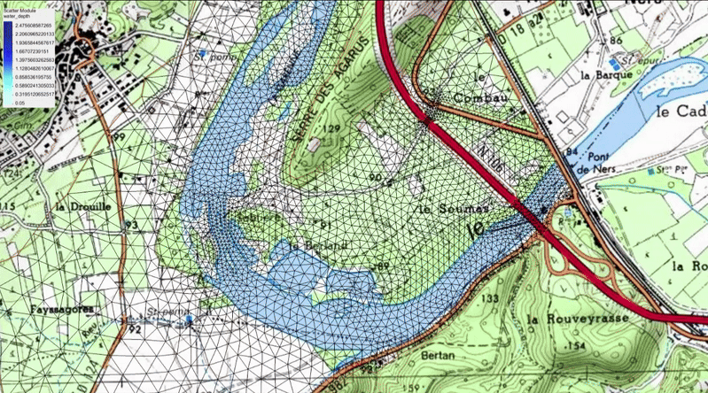

## Hi there 👋

- 🔭 I’m interested in numerical methods and mathematical modeling.
- 🌱 I'm a computational scientist from Politecnico di Milano. I spent 4 months as a research intern within the [Lemon team](https://www.inria.fr/fr/lemon) at the Inria branch in Montpellier, France. There I studied shallow water models with porosity and I developed a variational data assimilation framework to retrieve an enhanced porosity distribution and improve numerical results.
  

  
    
  *Gardon river overflow simulated with [SW2D](https://sw2d.inria.fr/), team Lemon @INRIA*
  

- 📫 You can reach me on [linkedin](https://www.linkedin.com/in/marcospadoni00/)

